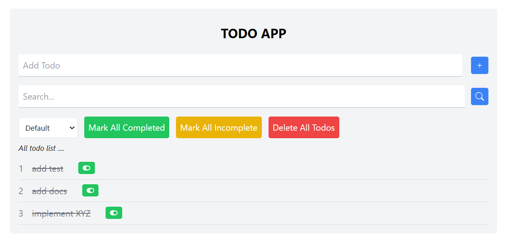

# Basic React Todo APP with Tailwind and Redux 

## All Actions
#### 1. add todo 
#### 2. search todo
#### 3. delete todo
#### 4. filter option default, incomplete, complete
#### 5. mark all completed button
#### 6. toggle incomplete and complete
#### 7. mark All incomplete
#### 8. Delete All

 

